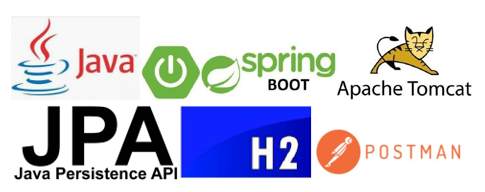
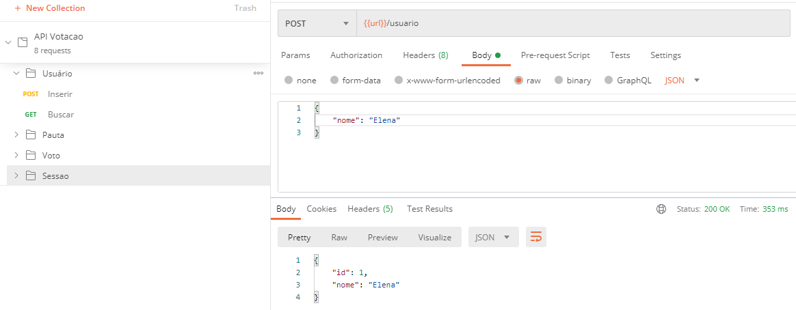
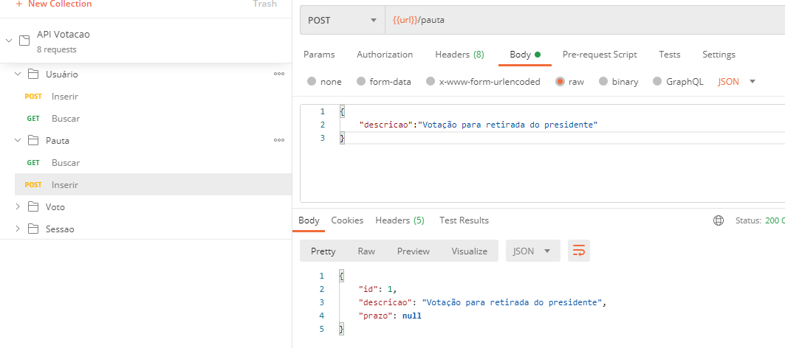
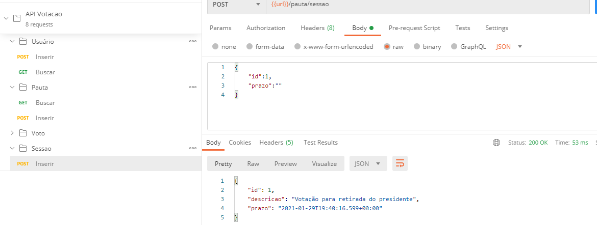
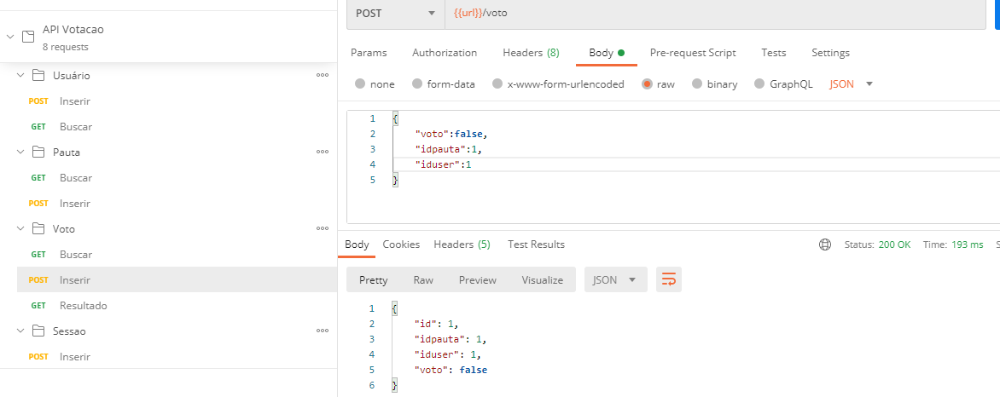
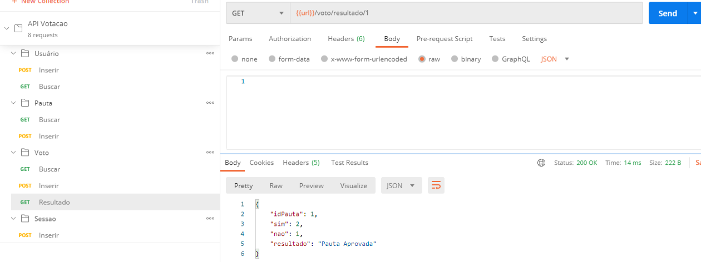

# Desafio Técnico Sicredi, solução BACK-END para Gerenciar Sessões de Votação em Assembleias

# Autor: Guilherme Pinto Pinheiro 

# Solução Back-end para	Gerenciar Sessões de Votação em Assembleias

No cooperativismo, cada associado possui um voto e as decisões são tomadas em assembleias, por votação.
A partir disso, você precisa criar uma solução back-end para gerenciar essas sessões de votação.
Essa solução deve ser executada na nuvem e promover as seguintes funcionalidades através de uma API REST:

● Cadastrar uma nova pauta;

● Abrir uma sessão de votação em uma pauta (a sessão de votação deve ficar aberta por um tempo determinado na chamada de abertura ou 1 minuto por default);

● Receber votos dos associados em pautas (os votos são apenas 'Sim'/'Não'. Cada associado é identificado por um id único e pode votar apenas uma vez por pauta);

● Contabilizar os votos e dar o resultado da votação na pauta.

Para fins de exercício, a segurança das interfaces foi abstraída e qualquer chamada para as interfaces em consideração é autorizada. 
A linguagem escolhida foi Java, e acabei utilizando algumas ferramentas como o Spring, JPA, H2 e Postman.
Algumas escolhas tomadas durante o desenvolvimento dessa aplicação me acrescentaram muitos novos conhecimentos e muitas novas idéias, 
que me fizeram transformar as mesmas em algo simples mas ao mesmo tempo limpo e funcional.

# Utilização Pelo Usuário

O responsável pela assembleia deve cadastrar os associados que ficarão aptos a votar, o mesmo também terá que cadastrar uma pauta de votação.
Após estes dois pré-requisitos estarem concluídos, pode-se abrir uma votação com o padrão de 1 minuto.
Durante a votação, os votantes podem fazer seu voto com a opção Sim ou Não, quando concluído o tempo de votar, o sistema informará o resultado.

# Procedimento

Todos os comandos foram testados e funcionam utilizando o Postman, as demais alternativas de envios de requisições como o Navegador Chrome, 
foram testadas tendo um comportamento muito semelhante ao Postman.

# ➣Usuario/ Cadastro

O utilizador pode cadastrar um usuário através do comando POST 
No Body deve-se utilizar nosso padrão Json a seguir:

{

"nome": "Elena"

}

Exemplo no Postman:

Isso também vale para buscarmos nosso usuário, porém ao invés do comando POST utilizamos GET como está na imagem a cima, 
lembrando que para cada usuário existe um id único.

# ➣Pauta / Cadastro

Após os usuários serem cadastrados, podemos começar a utilização da pauta.
Utilizaremos nosso mesmo padrão Json para o cadastro da pauta, em seu
Body pode-se passar a descrição da mesma, indicando sobre oque se trata a votação.

{

"descricao":"Votação para retirada do presidente"

}

Exemplo no Postman: 

Como nosso usuário, a pauta também poderá ser identificada por um id único.

# ➣Sessão / Abertura da sessão

Na abertura da nossa sessão, para inserir utilizaremos nosso comando POST, porém para iniciarmos a mesma, teremos que informar o id de nossa pauta através do Body no Postman, 
caso o id incorreto seja informado, ocorrerá uma mensagem de ERRO, em nossa abertura de sessão também teremos um prazo, caso o prazo inserido seja uma data inválida, 
no momento de inserção do voto ocorrerá um ERRO nos mostrando que a pauta está fechada e que teremos que informar uma data válida, 
caso não queira inserir uma data, podemos deixar o campo em branco que a data atual será inserida automaticamente.

{

"id":1,

"prazo":""

}

Exemplo no Postman:

Após informarmos os dados corretos, nossa votação se encontrará em andamento por 1 minuto.

# ➣Votação / Inserir Voto

Logo após a abertura de nossa sessão, podemos começar nossa inserção de votos, para esse procedimento utilizaremos nosso POST para passarmos no Body do Postman, 
o id de nosso usuário, o id da pauta escolhida para votar e nosso voto TRUE ou FALSE que em nosso resultado será “convertido” para String (Sim ou Não). 
Caso o id de nosso usuário e o id de nossa pauta forem inseridos incorretamente, também terá seu devido tratamento de erro indicando a forma correta, 
valendo o mesmo para a tentativa de receber o resultado antes do prazo e votar duas vezes ou mais.

{

"voto":false,

"idpauta":1, 

"iduser":1

}

Exemplo no Postman:

Após a inserção dos votos, basta apenas aguardar o encerramento da sessão para verificar o resultado.

# ➣ENCERRAMENTO DA VOTAÇÃO / Resultado 

Nosso resultado diferentemente da inserção que fizemos com POST anteriormente nas outras imagens, apenas utilizaremos o GET para buscar.
Como exemplo, adicionei 3 usuários e os mesmos informaram seus votos dando assim um bom entendimento para o resultado da votação, 
dois votaram SIM e um apenas votou NÃO. Caso a pauta receba mais votos negativos que positivos seu resultado será reprovado, caso contrário aprovada.

Exemplo no Postman:

Como podemos ver nosso resultado foi Pauta Aprovada, recebendo 2 votos positivos e 1 negativo, reconhecendo nossa pauta pelo id.

# ➣Persistência do Banco e Tratamento de Erros

Para um bom funcionamento e uma boa simplicidade no projeto acabei utilizando o próprio H2 que através de nosso console conseguiremos verificar os dados salvos no mesmo, 
conseguiremos ver nossa Tabela Pauta, Tabela Usuário e também nossa Tabela Votos.
Estava pensando em utilizar MySQL para a finalidade e persistência deste exercício, porém após uma boa estudada resolvi aproveitar o próprio H2 alterando alguns recursos em seu application properties tornando o mesmo persistente.
Os erros desta atividade como dito algumas vezes nas demonstrações anteriores, foram tratados de forma simples e produtiva, a cada erro, é gerada uma mensagem demonstrando onde ocorre o mesmo, com algumas alterações em alguns recursos de erro.

